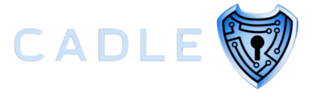

---
# CADLE - The Cyber Awareness Digital Learning Environment

CADLE is a web application designed to educate individuals, particularly Royal Navy personnel, on cybersecurity awareness. It provides an engaging and interactive learning experience through learning modules, quizzes, and future game-based activities. Employers can utilize CADLE to assign specific tasks and workloads to employees based on their roles.

## Features:

- **Learning Modules:** Interactive modules covering various aspects of cybersecurity awareness.
- **Quizzes:** Assessments to test knowledge and understanding of cybersecurity concepts.
- **Role-based Assignments:** Employers can assign specific tasks and workloads to employees based on their organisational roles.

## Setup Guide
###	Requirements:
	PHP (>=8.1)
	Composer
	Node.js (>=14.x)
	npm (>=6.x)
	MySQL database
###	Step 1: Clone the Project
1.	Open your terminal or command prompt.
2.	Navigate to the directory where you want to clone the project.
3.	Run the following command to clone the project repository:
git clone https://github.com/HMoreland1/CADLE.git


###	Step 2: Install PHP Dependencies
1.	Navigate into the cloned project directory:
2.	Run the following command to install PHP dependencies using Composer:
composer install
###	Step 3: Install Node.js Dependencies
1.	While still in the project directory, run the following command to install JavaScript dependencies using npm:
npm install
###	Step 4: Configure Database
1.	You will need a MySQL database to use with the application.
2.	Open the .env file in a text editor.
3.	Find the following lines and update them with your database credentials:
```
DB_CONNECTION=mysql
    DB_HOST=127.0.0.1
    DB_PORT=3306
    DB_DATABASE=your_database_name
    DB_USERNAME=your_database_username
    DB_PASSWORD=your_database_password
```
5.	Replace your_database_name, your_database_username, and your_database_password with your actual database details.
###	Step 5: Generate Application Key
1.	While still in the project directory, run the following command to generate an application key:
php artisan key:generate
###	Step 6: Run Migrations
1.	Run the database migrations to create necessary tables:
```php artisan migrate```
###	Step 7: Compile Frontend Assets
1.	To compile the frontend assets using Laravel Mix and Inertia.js, run the following command:
```npm run dev```
###	Step 8: Start the Development Server
1.	Finally, start the development server by running the following command:
```php artisan serve```
###	Step 9: Accessing the Application
1.	Once the server has started, open a web browser, and go to http://localhost:8000 to access the CADLE application.

## Security Considerations:

- User data is handled securely and protected using industry-standard encryption protocols.
- It is recommended to use CADLE only on trusted networks and devices to ensure data security.

## Technologies Used:

CADLE is built using the Laravel framework for web development.

## Contributing and Feedback:

If you encounter any issues or have suggestions for improvements, please contact us at [Harry.Moreland@students.plymouth.ac.uk](mailto:contact@example.com). We welcome contributions from the community to enhance CADLE's functionality and user experience.

## Additional Resources:

- User guides and tutorials will be made available on the CADLE website.

---

## Dependencies

CADLE is built on top of the Laravel framework and utilizes various packages and libraries to enhance its functionality. Below is a list of dependencies used in the project:

- **[guzzlehttp/guzzle](https://packagist.org/packages/guzzlehttp/guzzle)**: A PHP HTTP client library used for making HTTP requests.
- **[harishdurga/laravel-quiz](https://packagist.org/packages/harishdurga/laravel-quiz)**: A Laravel package for creating quizzes.
- **[inertiajs/inertia-laravel](https://packagist.org/packages/inertiajs/inertia-laravel)**: The Inertia.js adapter for Laravel.
- **[laravel/breeze](https://packagist.org/packages/laravel/breeze)**: A simple and minimalistic starter kit for Laravel.
- **[laravel/framework](https://packagist.org/packages/laravel/framework)**: The Laravel framework itself.
- **[laravel/sanctum](https://packagist.org/packages/laravel/sanctum)**: Laravel Sanctum provides a lightweight authentication system for SPAs and simple APIs.
- **[laravel/tinker](https://packagist.org/packages/laravel/tinker)**: Laravel Tinker is a powerful REPL for testing with Laravel applications.
- **[orchid/platform](https://packagist.org/packages/orchid/platform)**: A platform for back-office applications, admin panels, and dashboards.


### Development Dependencies

In addition to the above dependencies, the project also relies on several development dependencies for testing, debugging, and development purposes:

- **[fakerphp/faker](https://packagist.org/packages/fakerphp/faker)**: A PHP library for generating fake data.
- **[laravel/pint](https://packagist.org/packages/laravel/pint)**: Laravel Package Installer.
- **[laravel/sail](https://packagist.org/packages/laravel/sail)**: Laravel Sail provides a Docker-powered local development experience for Laravel projects.
- **[mockery/mockery](https://packagist.org/packages/mockery/mockery)**: A simple yet flexible PHP mock object framework for use in unit testing.
- **[nunomaduro/collision](https://packagist.org/packages/nunomaduro/collision)**: Error handler, CLI tool, and REPL for PHP.
- **[pestphp/pest](https://packagist.org/packages/pestphp/pest)**: An elegant PHP testing framework with a focus on simplicity.
- **[pestphp/pest-plugin-laravel](https://packagist.org/packages/pestphp/pest-plugin-laravel)**: Laravel Plugin for the Pest Testing Framework.
- **[spatie/laravel-ignition](https://packagist.org/packages/spatie/laravel-ignition)**: A beautiful error page for Laravel applications.

These dependencies are managed using Composer, the PHP dependency manager.
